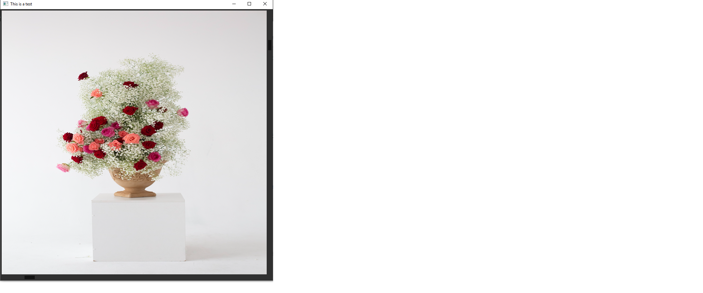

# Overview
[](https://pkg.go.dev/github.com/hujun-open/sbar)

sbar is a [fyne](https://fyne.io/) widge for scrollbar. 


# Usage
following is an example of using a vertical scrollbar:
```
	win.scrollBar = sbar.NewSBar(win.onScrollChange, false)
	win.SetContent(fyne.NewContainerWithLayout(
		layout.NewBorderLayout(nil, nil, nil, win.scrollBar),
		win.scrollBar, somewidget))
```
function win.onScrollChange is called whenever scollbar is dragged